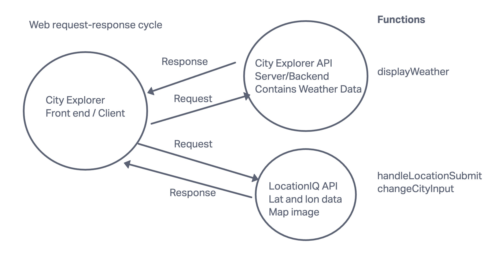
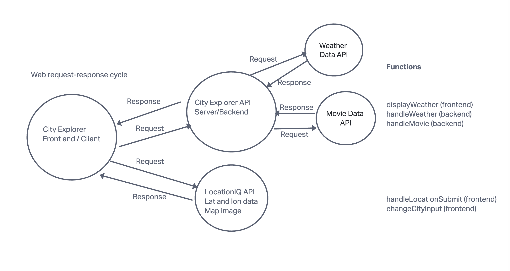
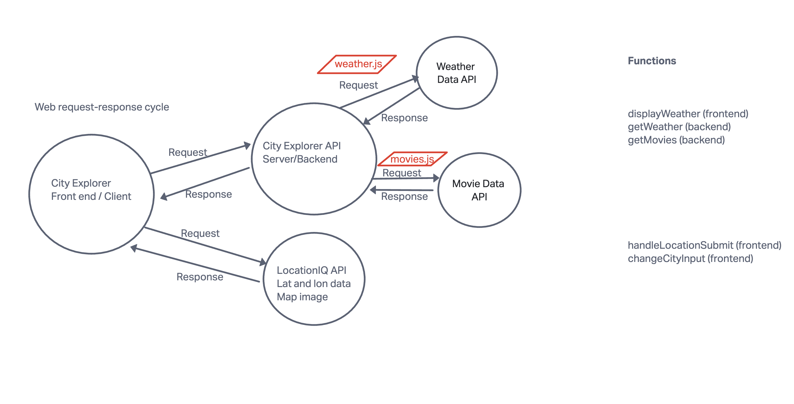

# City Explorer API

**Author**: Luke Rogers
**Version**: 2.1.0

## Overview

This server contains any city's seven day weather forecast and the top twenty movies set in the city. It is connected to the City Explorer front end.

## Getting Started

The user needs to set up the back end server and then connect it to the front end. Then the user needs to grab the data coming from the back end and display it nicely in the front end.

## Architecture

Technologies: JavaScript, Express.js, Node.js, ThunderClient

## Change Log

7/27/2023 [Version 1.0.1] - Set up server repository
8/3/2023 [Version 1.0.2] - Connected server to front end
8/9/2023 [Version 2.0.0] - Updated data to Weatherbit API and TMDB API

## Credit and Collaborations

Adnan Mohamud

## Time Estimates

Name of feature: Set up your server repository

Estimate of time needed to complete: 2 hours

Start time: 1:04 pm

Finish time: 3:59 pm

Actual time needed to complete: 2 hours 55 minutes

Name of feature: Weather (placeholder)

Estimate of time needed to complete: 3 hours

Start time: 3:51 pm

Finish time: 6:10 pm

Actual time needed to complete: 2 hours 19 minutes

Name of feature: Errors (revisited)

Estimate of time needed to complete: 1 hour

Start time: 6:10 pm

Finish time: 7:00 pm

Actual time needed to complete: 50 minutes

Name of feature: Weather (live)

Estimate of time needed to complete: 45 minutes

Start time: 3:20 pm

Finish time: 5:18 pm

Actual time needed to complete: 1 hour 52 minutes

Name of feature: Movies

Estimate of time needed to complete: 1 hour 30 minutes

Start time: 6:30 pm

Finish time: 7:24 pm

Actual time needed to complete: 56 minutes

Name of feature: Publish

Estimate of time needed to complete: 1 hour

Start time: 6:12 pm

Finish time: 7:15 pm

Actual time needed to complete: 1 hour 3 minutes

Name of feature: Refactor

Estimate of time needed to complete: 1 hour

Start time: 1:24pm

Finish time: 

Actual time needed to complete: 

## Web request-response cycle

